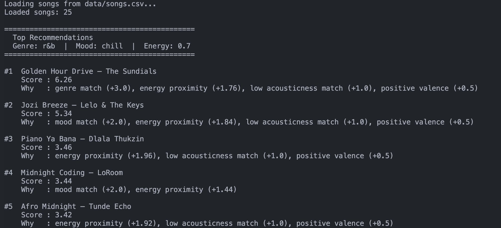
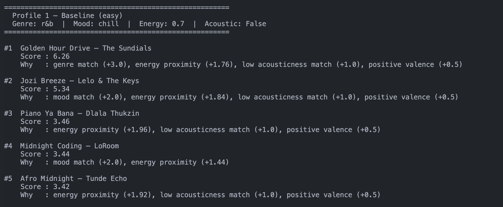
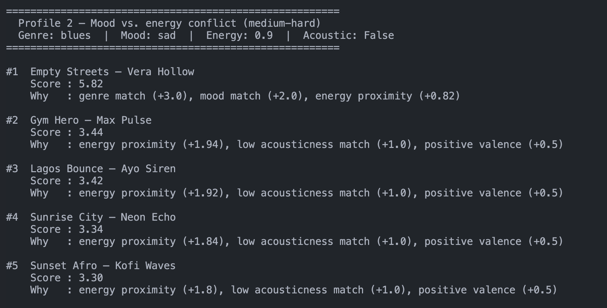
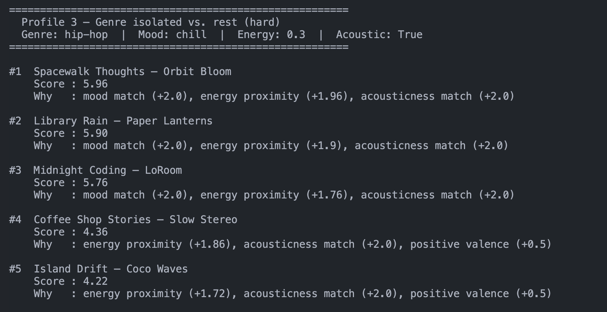
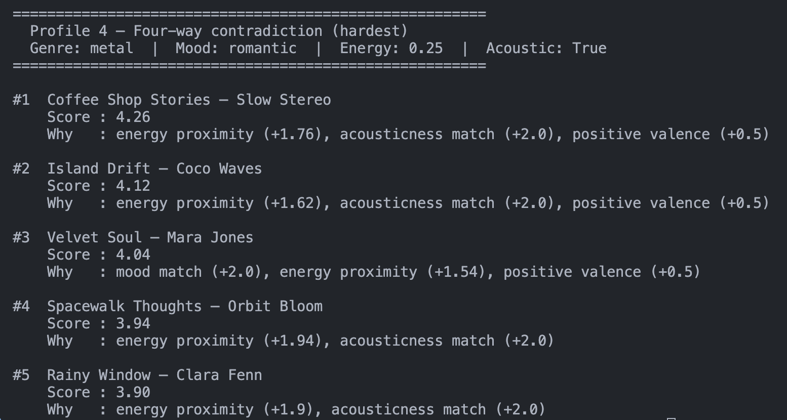

# 🎵 Music Recommender Simulation

## Project Summary

In this project you will build and explain a small music recommender system.

Your goal is to:

- Represent songs and a user "taste profile" as data
- Design a scoring rule that turns that data into recommendations
- Evaluate what your system gets right and wrong
- Reflect on how this mirrors real world AI recommenders

Replace this paragraph with your own summary of what your version does.

---

## How The System Works
Real-world systems like Spotify look at your full listening history, what you skip, what you replay, and what people similar to you enjoy. Our version is much simpler — it scores every song against your profile using a few rules (genre, mood, energy, acousticness), then picks the top results. It always prioritises familiarity over surprise, and it can't learn or change over time. But it shows the core idea: turn what we know about a user and a song into a number, then rank.

- What features does each `Song` use in your system
  - `genre` — the style of music (e.g. lofi, pop, rock)
  - `mood` — the feeling of the song (e.g. chill, happy, intense)
  - `energy` — how energetic the song is, from 0.0 (very calm) to 1.0 (very intense)
  - `acousticness` — how acoustic vs. electronic the song sounds, from 0.0 to 1.0
- What information does your `UserProfile` store
  - `favorite_genre` — the genre the user prefers most
  - `favorite_mood` — the mood the user usually listens to
  - `target_energy` — the energy level the user tends to enjoy (0.0 to 1.0)
  - `likes_acoustic` — whether the user prefers acoustic-sounding songs (true/false)
- How does your `Recommender` compute a score for each song
  - Tier 1: It prioritises the matching genre and mood equally. 
  - Tier 2: It rewards a song energy close to what the user normally likes
  - Tier 3: It revards a song depending on whether it matches the user's liking of acousticness
  - Tier 4: It might add a small bonus if the valence is positive.
- How do you choose which songs to recommend

- Potential biases to be aware of
  - Genre gets the highest weight (+3), so a perfect genre match can outrank a song that fits the user's mood, energy, and acousticness better overall
  - Users with niche genres (e.g. r&b, amapiano) get fewer genre matches in the catalog, so the genre bonus fires less often — the system effectively works better for common genres like pop or lofi
  - `likes_acoustic: false` only awards +1 vs. +2 for `true`, so acoustic-leaning users are rewarded more than non-acoustic ones
  - The system has no memory — it will recommend the same top songs every time, with no way to say "I've already heard that"

You can include a simple diagram or bullet list if helpful.

Demo:


User 1 Demo:




---

## Getting Started

### Setup

1. Create a virtual environment (optional but recommended):

   ```bash
   python -m venv .venv
   source .venv/bin/activate      # Mac or Linux
   .venv\Scripts\activate         # Windows

2. Install dependencies

```bash
pip install -r requirements.txt
```

3. Run the app:

```bash
python -m src.main
```

### Running Tests

Run the starter tests with:

```bash
pytest
```

You can add more tests in `tests/test_recommender.py`.

---

## Experiments You Tried

- When I dropped the genre weight from +3 down to +1.5, the recommendations got noticeably more varied — songs from completely different genres started showing up because energy and mood had enough room to compete. It felt less "correct" but more interesting.
- When I pushed genre back up to +4, the top result almost always matched the user's genre, but spots #2–#5 felt repetitive. It confirmed that genre being too dominant just turns the algorithm into a genre filter with extra steps.
- Adding the valence bonus (+0.5) didn't change the rankings much on its own — it mostly acted as a tiebreaker when two songs were already close in score, which was exactly the intention.
- The four test profiles showed how differently the system behaves depending on how well a user's preferences are represented in the catalog. The r&b/chill profile got clean, consistent results because the preferences were aligned. The metal/romantic profile produced results that felt almost random — the only metal song in the catalog clashed with every other preference, so unrelated songs kept winning on points. See `reflection.md` for a side-by-side comparison.

---

## Limitations and Risks

- Only 25 songs — most genres have 1–3 entries, so recommendations get repetitive fast
- Genre dominates the score (+4), which can bury otherwise great matches from different genres
- No memory — it recommends the same songs every time, forever
- Can't hear the music — tempo, lyrics, and instrumentation are completely invisible to it
- Non-acoustic users are slightly underserved since their acousticness bonus is half of acoustic users'

See the model card for a deeper breakdown.

---

## Reflection

Read and complete `model_card.md`:

[**Model Card**](model_card.md)

Write 1 to 2 paragraphs here about what you learned:

- about how recommenders turn data into predictions
- about where bias or unfairness could show up in systems like this


---

## 7. `model_card_template.md`

Combines reflection and model card framing from the Module 3 guidance. :contentReference[oaicite:2]{index=2}  

```markdown
# 🎧 Model Card - Music Recommender Simulation

## 1. Model Name

**URRadio 1.0**

---

## 2. Intended Use


URRadio 1.0 generates a ranked list of song recommendations from a small catalog based on a user's stated preferences — their favorite genre, mood, energy level, and whether they lean toward acoustic or electronic sounds. It assumes the user knows what they like and can describe it upfront, rather than learning from listening history over time. This is a classroom simulation, not a production tool — it's built to demonstrate how content-based filtering works under the hood, not to serve real users at scale.

---

## 3. How It Works (Short Explanation)

Every song in the catalog gets a score based on how well it matches the user's profile. Genre is worth the most — if a song matches the user's favorite genre, it gets +4 points right away. Mood match adds +2. Energy is a sliding scale: a song that's the exact right energy level earns up to +2, and that bonus shrinks the further away it is. Acousticness adds +2 if the user likes acoustic sounds and the song fits, or +1 if they prefer electronic-sounding songs. Finally, a small +0.5 bonus goes to songs with a generally positive, upbeat feel. Once every song is scored, they're sorted from highest to lowest and the top 5 are returned. I adjusted the original weights during testing — genre started at +3, got dropped to +1.5 to experiment with energy-first recommendations, then bumped back up to +4 once I decided genre should be the dominant signal.

---

## 4. Data  

The catalog has 25 songs. The starter dataset had 10, and I added 15 more to fill in genres that were missing — r&b, hip-hop, blues, electronic, classical, country, funk, soul, metal, reggae, afrobeats, and amapiano. Moods covered include happy, chill, intense, romantic, sad, melancholic, nostalgic, uplifting, energetic, angry, and dreamy. That said, most genres still only have 1–3 songs, which is thin — a real recommender would need hundreds of entries per genre to produce genuinely diverse results. Certain tastes are also completely absent, like K-pop, Latin, gospel, or anything with non-English lyrics, which means the catalog reflects a fairly narrow slice of global music.

---

## 5. Strengths  

The system works best for users whose preferences are internally consistent — someone who likes pop, wants happy songs, and has mid-to-high energy will get results that feel right almost every time because all the signals point in the same direction. The energy scoring is probably the most satisfying part — because it's a sliding scale rather than a yes/no, it naturally separates songs that are close from ones that are way off, without needing any tuning. The reasons output is also a genuine strength: every recommendation comes with a plain-language explanation of exactly why it scored the way it did, which makes it easy to spot when the algorithm did something unexpected and understand why.

---

## 6. Limitations and Bias 

The system doesn't consider anything about the actual sound of a song beyond energy and acousticness — things like tempo, lyrics, instrumentation, or language are completely invisible to it, so two songs in the same genre can feel totally different in real life but score identically here. Genre is weighted the heaviest (+4), which means users whose favorite genre only appears once or twice in the 25-song catalog — like blues or metal fans — barely benefit from that bonus and end up with recommendations driven mostly by mood and energy instead. The scoring can also quietly favor acoustic-loving users, since matching `likes_acoustic: true` earns +2 while matching `likes_acoustic: false` only earns +1, meaning non-acoustic users get weaker protection from songs they probably wouldn't enjoy. Finally, the system has no memory and no way to learn — it will always recommend the same songs for the same profile, with no way to say "I've already heard that one." 

---

## 7. Evaluation  

I tested four profiles designed to stress different parts of the algorithm — a straightforward r&b/chill baseline, a blues fan whose energy and acoustic preferences directly contradicted the only blues song in the catalog, a hip-hop listener whose mood and energy pointed toward lofi instead, and a metal fan with preferences that conflicted with the only metal song on literally every scoring dimension. What I was mostly looking for was whether the genre bonus was strong enough to keep the "right" song near the top even when everything else pushed against it. What surprised me was how quickly genre gets buried when the catalog is thin — for the metal and blues profiles, the genre match showed up in the results but rarely at #1, because songs from completely different genres stacked up enough mood, energy, and acoustic points to beat it. I also compared results before and after adjusting the genre weight from +1.5 to +4, and the difference was noticeable — the intended genre matches climbed the rankings but the recommendations also felt less musically diverse as a result.

---

## 8. Future Work  

The most impactful next step would be adding a diversity rule — right now the top 5 can easily be dominated by the same genre, and forcing at least one or two different genres into the results would make recommendations feel less repetitive. I'd also want to add tempo as a preference, since energy and tempo aren't the same thing — a slow, heavy song and a fast, light song can have similar energy scores but feel completely different. On the user side, it'd be interesting to support multiple favorite genres or a "not this mood" filter, since real taste is rarely that clean. Longer term, connecting this to actual listening history — even just tracking which songs were skipped — would let the system learn instead of always returning the same list. One thing I'd really love to add is a genre openness setting on the user profile — basically a slider for how willing someone is to go outside their preferred genre. Someone who says they're open to anything should get a more adventurous mix, while someone who only ever wants their genre should have that respected. Right now the system treats everyone the same way, but understanding how much variety a user is actually up for feels like one of the most honest signals you could ask for — and it would make the recommendations feel a lot more personal.

---

## 9. Personal Reflection  

Building this made me realize how much of a recommender's behavior comes down to weight choices — the actual math is simple, but deciding how much genre should matter compared to mood, or whether energy should outrank acousticness, shapes the entire personality of the system. The most unexpected thing was seeing how badly the algorithm handled users whose genre preferences conflicted with their other preferences — a metal fan who wants chill, acoustic music is technically coherent as a person, but the system had no way to handle that gracefully. It also changed how I think about Spotify or YouTube recommendations: what feels like the app "getting" your taste is probably a much messier combination of weights, catalog coverage, and past behavior data working together — and when it gets it wrong, it's often for exactly the same reason my system does.
